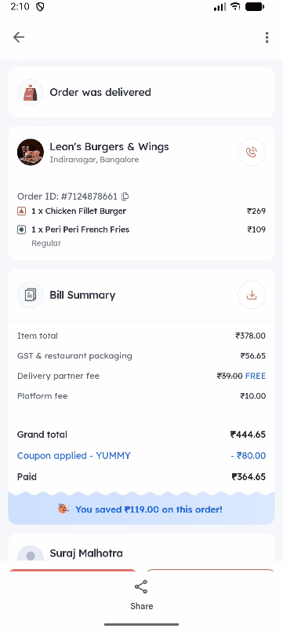
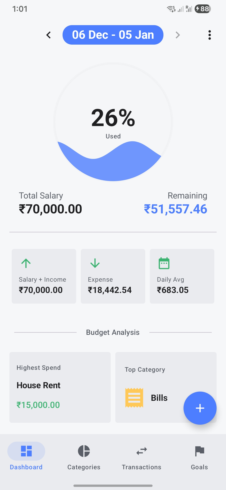
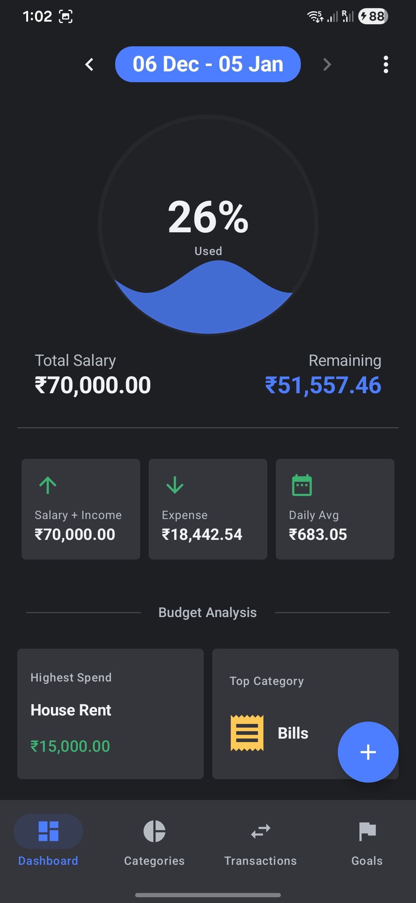

<div align="center">
  
  <h1 style="border-bottom: none; margin-bottom: 0;">SpendShot</h1>

  <h3 align="center" style="margin-top: 0;">
    <a href="https://spendshot.com">spendshot.com</a>
  </h3>

  <p align="center">
    <a href="https://github.com/mrT4ntr4/SpendShot/releases"></a>
    
    
    
    
    
    <a href="https://github.com/mrT4ntr4/SpendShot/blob/main/LICENSE"></a>
  </p>
</div>

---

SpendShot is a privacy-focused offline expense tracking app for Android. It uses on-device machine learning models to automatically detect and categorize transactions from payment app screenshots, meaning no internet connection is required and your financial data never leaves your device.

<div align="center">
  

</div>

## Features

- **Screenshot-based Logging**: Share a payment screenshot to the app and it automatically extracts the amount, merchant, and category using on-device ML (YOLO + TFLite).
- **Smart Categorization**: Auto-categorizes transactions based on merchant history and keyword matching.
- **Budget Tracking**: Set monthly budgets per category and track your spending against them.
- **Goals**: Set savings goals and track your progress over time.
- **Reports**: View category-wise breakdowns and spending trends.
- **Biometric Lock**: Secure the app using your device's fingerprint, face unlock, or PIN.
- **Open Source**: Fully free and open-source, with no premium limits or paywalls.
- **Auto-Updates**: The app checks for and downloads new releases directly from GitHub.

## Supported Apps

SpendShot currently supports extracting transaction data from the following apps:

<div align="center">
  <table>
    <tr>
      <td align="center" style="border: none;">
        <br>
        Google Pay
      </td>
      <td align="center" style="border: none;">
        <br>
        PhonePe
      </td>
      <td align="center" style="border: none;">
        <br>
        Swiggy
      </td>
      <td align="center" style="border: none;">
        <br>
        Zomato
      </td>
    </tr>
  </table>
</div>

## App Screenshots

<div align="center">
  <table>
    <tr>
      <td align="center"></td>
      <td align="center"></td>
    </tr>
    <tr>
      <td align="center"><em>Light Theme</em></td>
      <td align="center"><em>Dark Theme</em></td>
    </tr>
  </table>
</div>

## Tech Stack

- **Language:** Kotlin
- **UI:** Jetpack Compose + Material 3
- **Architecture:** MVVM + Hilt (Dependency Injection)
- **Database:** Room
- **ML:** TensorFlow Lite (custom classifier + YOLO detector)
- **OCR:** Google ML Kit Text Recognition

## Building the App

### Prerequisites
- Android Studio Ladybug or later
- JDK 17+
- Android SDK 35

### Steps
1. Clone the repository:
   ```bash
   git clone https://github.com/mrT4ntr4/SpendShot.git
   ```
2. Open the project in Android Studio.
3. Sync Gradle and build the project:
   ```bash
   ./gradlew assembleDebug
   ```
4. Install the generated APK on your device or emulator.

## Project Structure

```
app/src/main/java/com/spendshot/android/
├── data/           # Room entities, DAOs, and repositories
├── di/             # Hilt dependency injection modules
├── domain/         # Business logic (e.g., ReceiptProcessor)
├── ui/             # Composable screens, components, and navigation
├── utils/          # ML models, classifiers, and helper functions
├── viewmodels/     # ViewModels handling UI state
└── MainActivity.kt
```

## ML Models

The app ships with two pre-trained TFLite models located in `app/src/main/assets/`:
- `model_classifier.tflite` - Classifies which payment app a screenshot belongs to (e.g., GPay, PhonePe, Swiggy).
- `model_extractor.tflite` - A YOLO-based object detector that locates the amount and merchant name regions within the screenshots.

## Contributing

Contributions are always welcome. To contribute:
1. Fork the repository.
2. Create a new feature branch (`git checkout -b feature/your-feature`).
3. Commit your changes.
4. Push to the branch.
5. Open a Pull Request.

## License

This project is licensed under the GNU General Public License v3.0 (GPLv3) - see the [LICENSE](LICENSE) file for more details.
